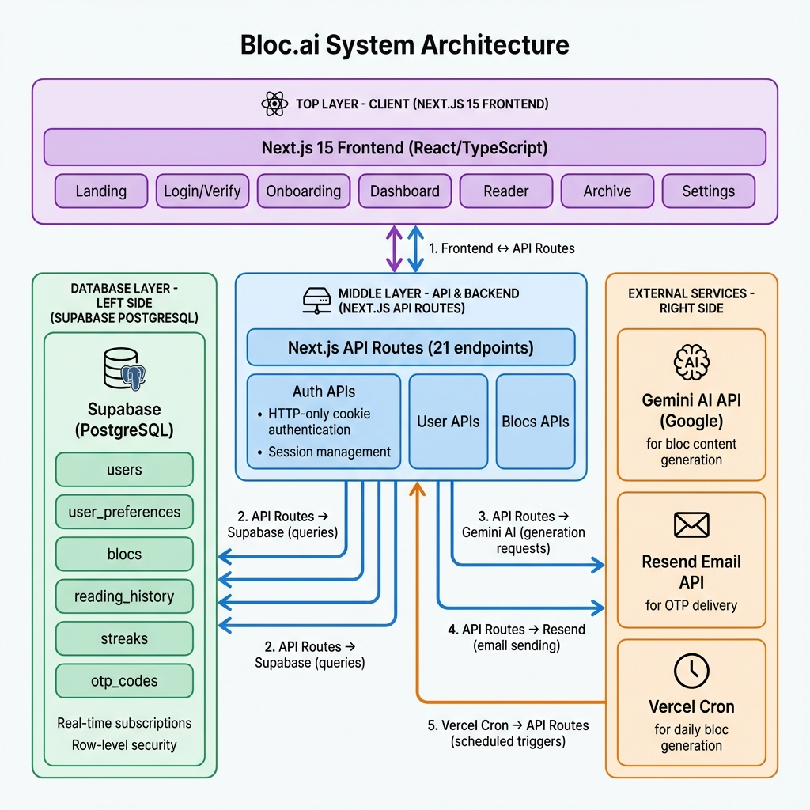

# Bloc.ai System Architecture



## Architecture Overview

Bloc.ai is built as a modern, serverless web application using Next.js 15 with a layered architecture designed for scalability, maintainability, and optimal user experience.

---

## Layer 1: Client Layer

### Technology Stack
- **Framework**: Next.js 15 (App Router)
- **Language**: TypeScript 5.7
- **Styling**: TailwindCSS 3.4 + Custom Design System
- **State Management**: React Hooks + Server Components

### Pages & Routes
1. **Landing** (`/`) - Marketing page with value proposition
2. **Authentication** (`/login`, `/verify`, `/set-password`) - OTP-based auth flow
3. **Onboarding** (`/onboarding/*`) - 5-step wizard (username, bio, topics, schedule, time, welcome)
4. **Dashboard** (`/dashboard`) - Main app hub with today's blocs
5. **Reader** (`/bloc/[id]`) - Immersive reading experience
6. **Archive** (`/archive`) - Historical reading data
7. **Settings** (`/settings`) - Preference management

### Client-Side Features
- Server-side rendering (SSR) for SEO
- Client-side hydration for interactivity
- Optimistic UI updates
- Cookie-based session persistence
- Responsive design (mobile-first)

---

## Layer 2: API & Backend Layer

### API Architecture
- **Type**: RESTful API
- **Format**: JSON request/response
- **Authentication**: HTTP-only cookies
- **Rate Limiting**: Per-endpoint limits

### API Groups (21 Endpoints)

**Authentication APIs** (6 endpoints)
- `POST /api/auth/send-otp` - OTP generation & email
- `POST /api/auth/verify-otp` - OTP verification & session
- `POST /api/auth/check-email` - Email existence check
- `POST /api/auth/login-password` - Password auth
- `POST /api/auth/set-password` - Password setup
- `POST /api/auth/logout` - Session termination

**User Management APIs** (5 endpoints)
- `GET /api/user/profile` - User info retrieval
- `GET /api/user/preferences` - Fetch preferences
- `POST /api/user/preferences` - Save/update preferences
- `POST /api/user/set-username` - Username assignment
- `GET /api/user/streak` - Streak data

**Bloc Management APIs** (8 endpoints)
- `GET /api/blocs/today` - Today's scheduled blocs
- `GET /api/blocs/[id]` - Individual bloc content
- `POST /api/blocs/[id]/complete` - Mark as read
- `POST /api/blocs/generate-today` - Manual generation trigger
- `POST /api/blocs/generate-bonus` - On-demand bonus bloc
- `GET /api/blocs/archive` - Paginated archive
- `POST /api/cron/generate-blocs` - Automated daily generation

**Archive & Debug APIs** (2 endpoints)
- `GET /api/archive` - Reading history
- `GET /api/debug/test-gemini` - AI connectivity test

### Session Management
- **Storage**: HTTP-only cookies (`bloc_user_id`)
- **Duration**: 30 days
- **Security**: Secure flag in production, SameSite=Lax
- **Validation**: Cookie checked on each authenticated request

---

## Layer 3: Database Layer

### Database Platform: Supabase (PostgreSQL)

### Schema Design

**`users` table**
```sql
- id (UUID, PK)
- email (TEXT, UNIQUE, NOT NULL)
- username (TEXT, UNIQUE)
- password_hash (TEXT, nullable)
- created_at (TIMESTAMP)
- last_login (TIMESTAMP)
```

**`user_preferences` table**
```sql
- user_id (UUID, FK → users.id, PK)
- bio (TEXT, max 500 chars)
- topics (TEXT[], 1-3 items)
- reading_days (TEXT: weekdays|weekends|daily)
- preferred_time (TIME)
- timezone (TEXT)
- updated_at (TIMESTAMP)
```

**`otp_codes` table**
```sql
- email (TEXT)
- code (TEXT, 6 digits)
- expires_at (TIMESTAMP, +5 min)
- created_at (TIMESTAMP)
```

**`blocs` table**
```sql
- id (UUID, PK)
- user_id (UUID, FK → users.id)
- topic (TEXT)
- title (TEXT)
- content (TEXT, markdown)
- scheduled_date (DATE)
- generated_at (TIMESTAMP)
- continuity_reference (TEXT)
- status (TEXT: pending|generated|failed)
```

**`reading_history` table**
```sql
- user_id (UUID, FK → users.id)
- bloc_id (UUID, FK → blocs.id)
- completed_at (TIMESTAMP)
- reading_progress (INTEGER, 0-100)
- PRIMARY KEY (user_id, bloc_id)
```

**`streaks` table**
```sql
- user_id (UUID, FK → users.id, PK)
- current_streak (INTEGER)
- longest_streak (INTEGER)
- last_read_date (DATE)
```

### Database Features
- Row-level security (RLS) policies
- Real-time subscriptions (future feature)
- Automatic timestamps
- Cascade deletes on user removal
- Indexed foreign keys for performance

---

## Layer 4: External Services

### 1. Gemini AI (Google)
**Purpose**: AI-powered bloc content generation

**Integration**:
- SDK: `@google/generative-ai`
- Model: `gemini-pro`
- API Key: Server-side environment variable

**Generation Process**:
1. Fetch user preferences (bio, topics)
2. Retrieve previous day's bloc for continuity
3. Construct personalized prompt
4. Call Gemini API with context
5. Parse JSON response (title, content, next-day teaser)
6. Store generated bloc in database

**Prompt Engineering**:
- Context: User bio, selected topic, yesterday's reference
- Constraints: ~1500 words (10-min read), markdown format
- Structure: Intro → 3-4 concepts → "Why it matters" → Teaser
- Tone: Conversational, inspiring, not academic

**Error Handling**:
- Retry logic (3 attempts)
- Fallback to generic content on failure
- Status tracking (pending → generated/failed)

### 2. Resend Email Service
**Purpose**: OTP delivery via email

**Integration**:
- SDK: `resend`
- Sender: `onboarding@resend.dev` (should use verified domain)

**Email Template**:
- Branded HTML email
- Purple-amber gradient styling
- 6-digit OTP prominently displayed
- 5-minute expiry notice
- Responsive design

**Rate Limiting**:
- 5 OTP requests per email per 15 minutes
- Prevents abuse and spam

### 3. Vercel Cron Jobs
**Purpose**: Automated daily bloc generation

**Configuration**:
```json
{
  "crons": [{
    "path": "/api/cron/generate-blocs",
    "schedule": "0 0 * * *"
  }]
}
```

**Process**:
1. Runs daily at midnight UTC
2. Fetches all users with today's reading day
3. Generates blocs for each user asynchronously
4. Updates bloc status in database
5. Logs generation metrics

---

## Data Flow Patterns

### 1. User Registration Flow
```
Client → POST /api/auth/send-otp → Resend → User Email
Client → POST /api/auth/verify-otp → Supabase (verify OTP)
Supabase → Create user record → Set cookie → Client
Client → Navigate to /onboarding
```

### 2. Onboarding Flow
```
Client → Complete 5 steps → POST /api/user/preferences
API → Validate data → Supabase (insert preferences)
Client → Navigate to /dashboard
```

### 3. Daily Bloc Generation (Automated)
```
Vercel Cron → POST /api/cron/generate-blocs
API → Fetch users with today's reading day
For each user:
  API → Fetch preferences → Gemini AI (generate content)
  Gemini → Return content → API → Supabase (insert bloc)
```

### 4. Bloc Reading Flow
```
Client → GET /api/blocs/today → Supabase → Return blocs
Client → Render dashboard with bloc cards
User clicks → Navigate to /bloc/[id]
Client → GET /api/blocs/[id] → Render content
User completes → POST /api/blocs/[id]/complete
API → Supabase (insert reading_history, update streak)
Client → Show completion modal with streak
```

### 5. Archive Access
```
Client → GET /api/archive → Supabase
JOIN reading_history WITH blocs
Return sorted by completed_at DESC
Client → Render calendar/list view
```

---

## Security Architecture

### Authentication
- **No passwords required** (OTP-first)
- Optional password for returning users
- Session: 30-day HTTP-only cookies
- OTP: 5-minute expiry, single-use

### Authorization
- User-scoped data access
- Cookie validation on protected endpoints
- Supabase RLS policies (future)

### Data Protection
- **In Transit**: HTTPS only
- **At Rest**: Supabase encryption
- **Secrets**: Environment variables, never in code
- **Cookies**: HttpOnly, Secure (prod), SameSite=Lax

### Rate Limiting
- OTP: 5 per 15 min per email
- API: 100 requests/min per user
- Prevents abuse and DDoS

---

## Deployment Architecture

### Hosting: Vercel
- **Frontend**: Edge network CDN
- **API**: Serverless functions (AWS Lambda)
- **Region**: Auto-selected based on user location
- **Cron**: Built-in cron job support

### Environment Variables
```
NEXT_PUBLIC_SUPABASE_URL
NEXT_PUBLIC_SUPABASE_ANON_KEY
GEMINI_API_KEY
RESEND_API_KEY
NEXT_PUBLIC_APP_URL
```

### Build Process
1. Install dependencies (`npm install`)
2. TypeScript compilation
3. Next.js build (`npm run build`)
4. Static + SSR optimization
5. Deploy to Vercel edge network

---

## Scalability Considerations

### Current Capacity
- **Database**: Supabase free tier (500 MB, upgradable)
- **AI**: Gemini free tier (60 req/min)
- **Email**: Resend free tier (3,000/month)
- **Serverless**: Vercel auto-scales

### Scaling Strategy

**Phase 1 - MVP (0-1,000 users)**
- Free tier services sufficient
- Single region deployment
- Basic monitoring

**Phase 2 - Growth (1,000-10,000 users)**
- Upgrade Supabase to Pro ($25/mo)
- Batch AI generation overnight
- CDN caching for static content
- Implement Redis for session storage

**Phase 3 - Scale (10,000+ users)**
- Horizontal scaling with Vercel Pro
- Database read replicas
- Gemini API paid tier for higher limits
- Queue system for async jobs (Vercel Queue)
- Analytics and monitoring (Sentry, PostHog)

### Performance Optimization
- Next.js image optimization
- Code splitting and lazy loading
- Static generation for public pages
- Edge caching for API responses
- Database query optimization (indexes)

---

## Monitoring & Observability

### Metrics to Track
- API response times
- Bloc generation success rate
- User retention (Day 1, 3, 7)
- Streak distribution
- Topic popularity
- Error rates by endpoint

### Tools (Recommended)
- **Application**: Vercel Analytics
- **Errors**: Sentry
- **Database**: Supabase dashboard
- **User behavior**: PostHog or Mixpanel

---

## Future Architecture Enhancements

### Short-term (3-6 months)
- Redis cache layer for hot data
- WebSockets for real-time features
- Background job queue (Vercel Queue)
- Enhanced error tracking

### Long-term (6-12 months)
- Mobile apps (React Native)
- GraphQL API layer
- Multi-region deployment
- Advanced AI features (chat, recommendations)
- Community features (sharing, discussions)

---

**Last Updated**: December 2025  
**Architecture Version**: 1.0.0
